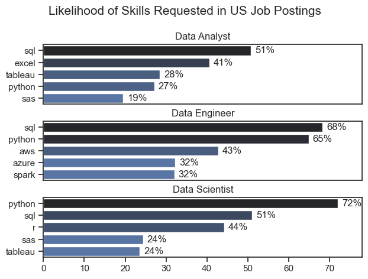
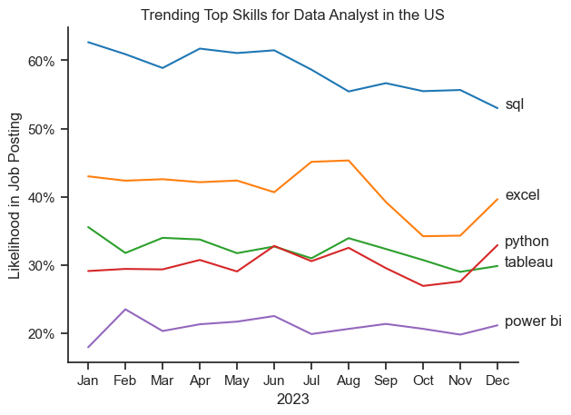

# Overview
Welcome to my analysis of the data job market, focusing on data analyst roles. This project was created out of a desire to navigate and understand the job market more effectively. It delves into the top-paying and in-demand skills to help find optimal job opportunities for data analysts.

The data sourced from Luke Barousse's Python Course which provides a foundation for my analysis, containing detailed information on job titles, salaries, locations, and essential skills. Through a series of Python scripts, I explore key questions such as the most demanded skills, salary trends, and the intersection of demand and salary in data analytics.

# The Questions

Below are the questions I want to answer in my project:

    1. What are the skills most in demand for the top 3 most popular data roles?
    2. How are in-demand skills trending for Data Analysts?
    3. How well do jobs and skills pay for Data Analysts?
    4. What are the optimal skills for data analysts to learn? (High Demand AND High Paying)

# Tools I Used 

For my deep dive into the data analyst job market, I harnessed the power of several key tools:

    - Python: The backbone of my analysis, allowing me to analyze the data and find critical insights. I also used the following Python libraries:
        - Pandas Library: This was used to analyze the data. 
        - Matplotlib Library: I visualized the data.
        - Seaborn Library: Helped ,e create more advanced visuals.

    - Jupyter Notebooks: The tool I used to run my Python scripts which let me easily include my notes and analysis.
    - Visual Studio Code: My go-to for executing my Python scripts.
    - Git & GitHub: Essential for version control and sharing my Python code and analysis, ensuring collaboration. 

# Data Preparation and Cleanup

This section outlines the steps taken to prepare the data for analysis, ensuring accuracy and usability.
## Import & Clean Up Data
I start by importing necessary libraries and loading the dataset, followed by initial data cleaning tasks to ensure data. Each Jupyter notebook for this project aimed at investigating specific aspects of the data job market. Here's how I approached each question: 

# The Analysis

## 1. What are the most demanded skills for the top 3 most popular data roles?

To find the most demanded skills for the top 3 most popular data roles. I filtered out those positions by which ones were the most popular, and got the top 5 skills for these top 3 roles. This query highlights the most popular job titles and their top skills, showing which skills I should pay attention to depending on the role I am targeting. 

View my notebook with detailed steps here: [2_Skill_Demand.ipynb](3_Project/2_Skill_Demand.ipynb)

### Visualize Data

    fig, ax = plt.subplots(len(job_titles), 1)

    sns.set_theme(style='ticks')

    for i, job_title in enumerate(job_titles):
    df_plot = df_skills_perc[df_skills_perc['job_title_short']== job_title].head(5)
    
    sns.barplot(data=df_plot, x='skill_percent', y='job_skills', ax=ax[i], hue='skills_count', palette='dark:b_r')
    plt.show()

### Results

### Insights

- Python is a versatile skill, highly demanded
across all three roles, but most prominently for Data Scientists (72%) and Data Engineers (65%).
- SQL is the most requested skill for Data
Analysts and Data Scientists, with it in over half the job postings for both roles. For Data Engineers, Python is the most sought-after skill, appearing in 68% of job postings.
- Data Engineers require more specialized
technical skills (AWS, Azure, Spark) compared to Data Analysts and Data Scientists who are expected to be proficient in more general data management and analysis tools (Excel, Tableau).

## 2. How are in-demand skills trending for Data Analysts?

### Visualize Data 
 

    from matplotlib.ticker import PercentFormatter
    plot=df_da_us_percent.iloc[:, :5]
    sns.lineplot(data=plot, dashes=False, legend='full', palette='tab10')
    plt.gca().yaxis.set_major_formatter(PercentFormatter(decimal=0))

    plt.show()

### Results

*Bar graph visualizing the trending top skills for data analysts in the US in 2023.*

### Insights:
- SQL remains the most consistently demanded skill throughout the year, although it shows a gradual decrease in demand. 
- Excel experienced a significant increase in demand starting around September, surpassing both Python and Tableau by the end of the year.
- Both Python and Tableau show relatively stable demand throughout the year with some fluctuations but remain essential skills for data analysts. Power BI, while less demanded compared to the others, shows a slight upward trend towards the year's end.

## 3. How well do jobs and skills pay for Data Analysts?

### Salary Analysis for Data Nerds

#### Visualize Data 

    sns.boxplot(data=df_usa_top, x='salary_year_avg', y='job_title_short', order=job_order)

    ticks_x = plt.FuncFormatter(lambda y, pos: f'${int(y/1000)}K)
    plt.gca().xaxis.set_major_formatter(ticks_x)
    plt.show()

####
 *Box plot visualizing the salary distributions for the top 6 data job titles.*

- There is a significant variation in salary ranges across different job titles. Senior Data Scientist positions tend to have the highest salary potential, with up to $600K, indicating the high value placed on advanced data skills and experience in the industry.

- Senior Data Engineer and Senior Data Scientist roles show a considerable number of outliers on the higher end of the salary spectrum, suggesting that exceptional skills or cicumstances can lead to high pay in these roles. In contrast, Data Analyst roles demonstrate more consistency in salary, with fewer outliers.

- The median salaries increase with seniority and specialization of the roles. Senior roles (Senior Data Scientist, Senior Data Engineer) not only have higher median salaries but also larger differences in typical salaries, reflecting greater variance in compensation as responsibilities increase. 

### Highest Paid & Most Demanded Skills for Data Analysts

#### Visualize Data 
    
    fig, ax = plt.subplots(2, 1)
    
    # Top 10 Highest Paid for Data Analysts
    sns.barplot(data=top_pay, x='median', y=top_pay.index, hue='median', ax=ax[0], palette='dark:b_r')
    
    # Top 10 Most In-Demand Skills for Data Analysts
    sns.barplot(data=df_da_skills, x='median', y=df_da_skills.index, hue='median', ax=ax[1], palette='light:b')
    
    plt.show()

#### Results
In-demand skills for data analysts in the US:

*Two separate bar graphs visualizing the highest paid skills and most in-demand skills for data analysts in the US.*

#### Insights:

- The top graop shows specialized technical skills like 'dplyr', 'Bitbucket' and 'Gitlab' are associated with higher salaries, some reaching up to $200K, suggesting that advanced technical proficiency can increase earning potential.

- The bottom graph highlights that foundational skills like 'Excel', 'PowerPoint' and 'SQL' are the most in-demand, even though they may not offer the highest salaries. This demonstates the importance of these core skills for employability in data analysis roles. 

- There's a clear distinction between the skills that are highest paid and those that are most in-demand. Data analysts aiming to maximize their career potential should consider developing a dicerse skill set that includes both high-paying specialized skills and widely demanded foundational skills.

## 4. What is the most optimal skill to learn for Data Analysts?

#### Visualize Data

    from adjustText import adjust_text
    from matplotlib.ticker import PercentFormatter

    sns.scatterplot(
    data=df_plot,
    x='skill_percent',
    y='median_salary',
    hue='technology'
    )

#### Result 

*A scatter plot visualizing the most optimal skills (high paying & high demand) for data analysts in the US.*

#### Insights

- The top graph shows that specialized technical skills like 'Python', 'Oracle', and 'SQL Server' are associated with higher salaries, some reaching up to $98K, suggesting that expertise in programming and databases can significantly boost earning potential.

- The bottom graph highlights that foundational skills like 'SQL', 'Excel', and 'Power BI' are the most in-demand, even though they may not offer the highest salaries. This demonstrates the importance of these core skills for employability in data analysis roles.

- There's a clear distinction between the skills that are highest paid and those that are most in demand. Data analysts aiming to maximize their career potential should develop a diverse skill set that includes both high-paying specialized skills (e.g., Python, SQL Server, Cloud Technologies) and widely demanded foundational skills (e.g., SQL, Excel, Power BI, Tableau).

# What I Learned
Throughout this project, I deepened my understanding of the data analyst job market and enhanced my technical skills in Python, especially in data manipulation and visualization. Here are a few specific things I learned:

- Advanced Python Usage: Utilizing libraries such as Pandas for data manipulation, Seaborn and Matplotlib for data visualization, and other libraries helped me perform complex data analysis tasks more efficiently.
- Data Cleaning Importance: I learned that through data cleaning and preparation are crucial before any analysis can be conducted, ensuring the accuracy of insights derived from the data. 
- Strategic Skill Analysis: The project emphasized the importance of aligning one's skills with market demand. Understanding the relationship between skill demand, salary and job availability allows for more strategic career planning in the tech industry.

# Instights

This project provided several general insights into the data job market for analysts:

- Skill Demand and Salary Correlation: There is a clear correlation between the demand for specific skills and  the salaries these skills command. Advanced and specialized skills like Python and Oracle often lead to higher salaries. 
- Market Trends: There are changing trends in skill demand, highlighting the dynamic nature of the data job market. Kepping up with these trends is essential for career growth in data analytcs.
- Economic Value of Skills: Understanding which skills are both in-demand and well-compensated can guide data analysts in prioritizing learning to maximize their economic returns.

# Conclusion 

This exploration into the data analyst job market has been incredibley informative, highlighting the critical skills and trends that shape this evolving field. The insights I got enhance my understanding and provide actionable guidance for anyone looking to advance their career ib data analytics. As the market continues to change, ongoing analysis will be essential to stay ahead in data analytics. This project is a good foundation for future explorations and inderscores the importance of continuous learning and adaptation in the data field. 